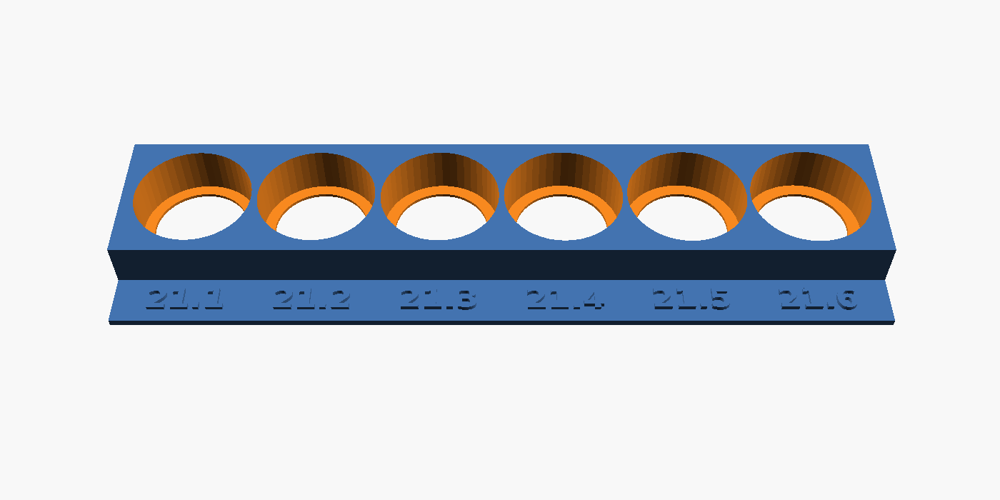
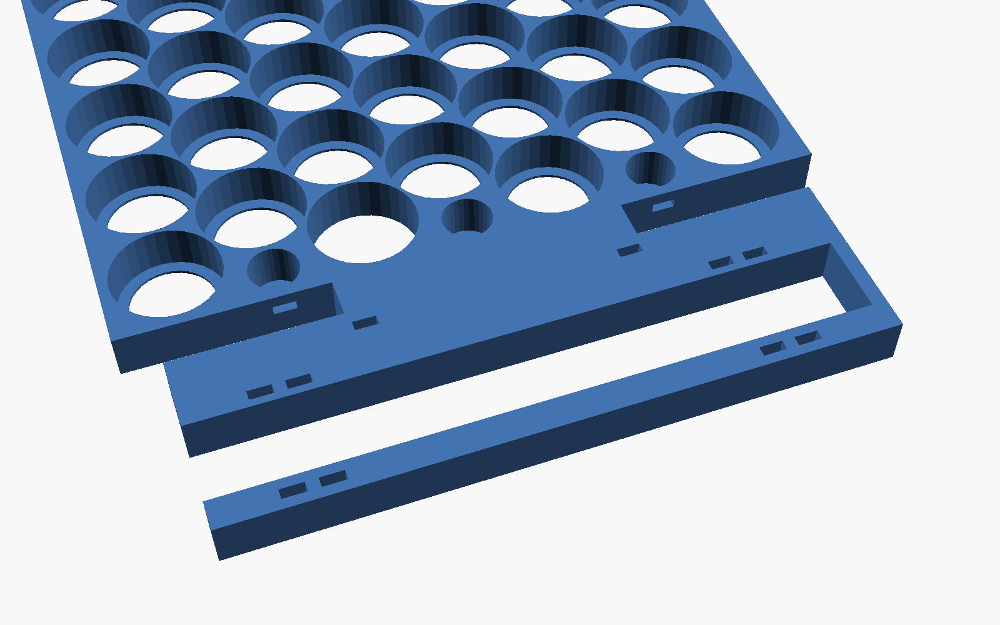
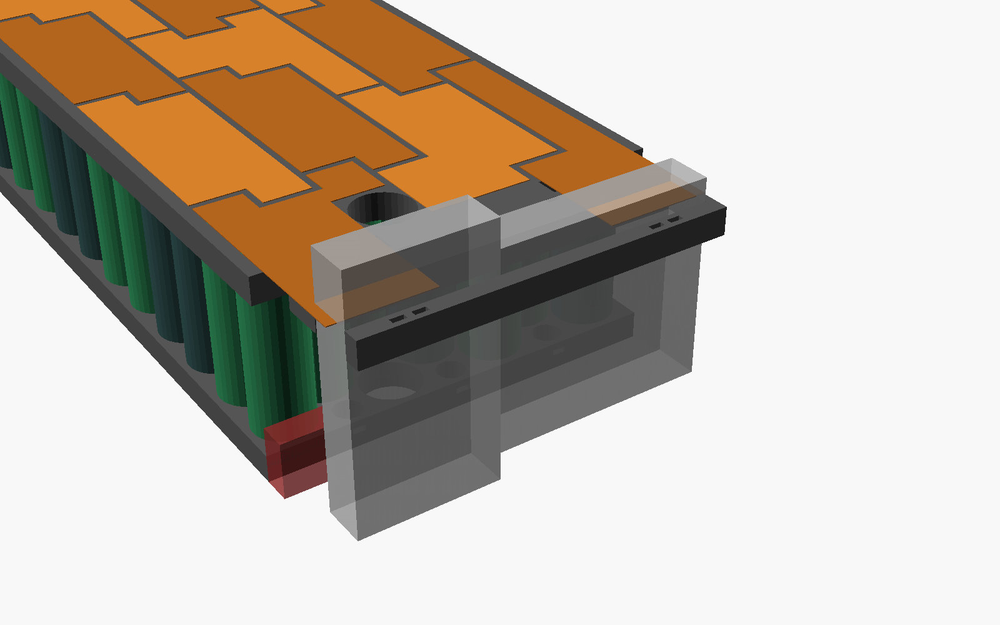

# MaxG3Cellholder

Cellholder for a custom 20s4p battery for the Segway Ninebot Max G3 without cutting the divider in the deck compartment.

* **Cells:** 80 × EVE INR21700-40P (Ø21.15 ±0.10 mm, 70.15 ±0.15 mm)
* **Configuration:** 20s4p, 72 V nominal / 84 V full
* **Envelope:** 141 × 270 mm footprint. Holder + cells are **71.8 mm** tall, which leaves ~9 mm of the 81 mm for copper, nickel, fish paper and heat shrink.
* **Placement:** the pack sits in front of the deck divider. The **BMS (ANT 24ZHE6-24S-220A) stands upright on the other side** of the divider, held by a dock that is **part of the top holder half**. Every lead and balance wire leaves the pack at the divider end.
* **Printed parts:** only what's needed. Just the two holder halves. The top one includes the BMS dock. No cover plates, no separate BMS holder.


---

## 1. What's in the repo

| Path | What it is |
|---|---|
| `stl/holder_bottom.stl`, `stl/holder_top.stl` | Cell holder halves, one piece each. Bottom is 270 mm long; top with BMS dock is 315 mm, so it needs a big bed. |
| `stl/holder_*_a.stl` / `_b.stl` | **The same halves split in two, for normal beds.** Every part fits a 256 × 256 bed (largest: `holder_top_a`, 214 × 141 mm, with the BMS dock). The two parts **lock together through 7 shared cell sockets** (§7). |
| `docs/copper_cutlist.svg` | **Copper cut list:** every distinct copper shape once, 1:1, with count, edge lengths and punch holes |
| `docs/copper_roll_plan.svg` | Every copper piece laid out on a **100 mm wide roll** |
| `docs/copper_top.svg`, `docs/copper_bottom.svg` | 1:1 position of every copper piece on each face, with punch holes, tab flaps and tongue fold lines |
| `docs/wiring_top.svg`, `docs/wiring_bottom.svg` | Wiring diagrams: group numbers, cell polarity, copper pieces and balance taps |
| `docs/layout.md` | Cut list table, plus every group, cell and copper piece |
| `scad/cellholder.scad` | Parametric OpenSCAD model: holder halves with BMS dock, tolerances, BMS size |
| `scad/layout_data.scad` | Generated layout data (do not edit by hand) |
| `generator/layout.py` | Generates the layout, copper pieces, diagrams and templates |

Coordinates used everywhere:

* **x** runs along the 270 mm length. **x = 0 is the divider end of the pack.**
* **y** runs across the 141 mm width. **y = 0 is the side wall the screw post's 80 mm is measured from.**
* **z** is up from the deck floor.

---

## 2. Layout and copper


The footprint fits a staggered grid of 7 rows (12/11/12/11/12/11/12) at 22.2 mm pitch. That makes **81 slots for 80 cells**. The spare slot is left empty at the divider end and doubles as a wire chase (§4).

There are two kinds of 4p group:

* **Line:** 4 cells in a straight line along a row.
* **Diamond:** 2 cells in one row and 2 in the row below, offset half a cell.

Either way, **two consecutive groups together make the standard copper piece**: two rows of 4 cells, 97 × 36 mm. That's two lines stacked, or two diamonds side by side. A 36 mm strip cut straight across the 100 mm roll *is* that piece (§ roll plan below).

**No two consecutive groups ever sit end to end in the same row.** Every series joint touches at 3 to 7 cells. That means **single-layer copper everywhere, no double copper**:

* The narrowest copper bridge between two groups is **~36 mm**.
* An end-to-end joint is only ~14 mm.

| Part of the pack | Groups | Pattern |
|---|---|---|
| Divider end | **G1 → G3** (G1 = **B−**, row 1) | G1 is a line; G2 and G3 are 3+1 shapes that fill the end of rows 2–4 |
| Middle lane, rows 4–5 | **G4 → G6** | Diamonds, away from the divider |
| | **G7** | Line in row 3, back |
| Top lane, rows 1–2 | **G8 → G11** | Diamonds, away from the divider |
| Far end | **G12 → G14** | Lines stacked in rows 3 → 5 |
| Bottom lane, rows 6–7 | **G15 → G19** | Diamonds, back to the divider |
| Divider end | **G20** (**B+**) | Rows 5–7 next to the wire chase |

### Copper pieces: one straight bar per row


**Each copper piece is a straight bar along each row of cells it covers.**

* Where a piece covers two rows, the two bars are offset by half a cell (that's how the cells are staggered), giving a simple **step shape**.
* Every edge is a straight, square cut.
* **Every cell is fully covered.** Each piece only covers the cells of its own groups, so it is easy to see where it goes.

| Shape | Count | Size | What it is |
|---|---|---|---|
| **A** | **7** | 97.4 × 36 mm | Standard piece: two 86.3 mm bars, offset 11.1 mm |
| **B** | **4** | 97.8 × 36 mm | Same, with one end squared off at the pack wall |
| **C** | **2** | 86.7 × 55.2 mm | Three bars, far end |
| D–I | 1 each | ~87–97 × 55.2 mm | Three-bar step shapes at the divider end and where the lanes meet |
| **B−**, **B+** | 1 each | 124 × 36 / 80 × 55 mm | With a **36 × 35 mm lead tongue** (main leads, §5) |

Every piece is straight bars with square cuts. `docs/copper_cutlist.svg` has a 1:1 template for each shape.

**How to prepare the copper:**

* **Punch holes:** there's one 8 mm circle over every cell. Punch a hole there, lay the nickel strip over the copper, and weld the nickel to the cell through the hole and to the copper around it. Change `PUNCH_D` in `generator/layout.py` if your punch is a different size. The hole must be smaller than the cell's positive cap.
* **Cells are recessed 0.6 mm:** each cell stops against a thin lip 0.6 mm below the holder face. The copper lies flat on the holder, and the nickel only has to dip about 0.8 mm (lip + copper) through the hole to reach the cell.
* **Roll plan: straight strips, no nesting.** One pack uses **98 cm of the 100 mm roll**. `docs/copper_roll_plan.svg` shows the order:
  1. **Strip 1, 124 mm:** B− and B+ lie side by side along the roll (the tongues make them too long to go across).
  2. **11 strips of 36 mm:** each one becomes an A or a B piece. The piece is 97.4 mm long, so trim ~2.5 mm off one end and cut the two 11.1 mm corner notches.
  3. **8 strips of 55 mm:** each one becomes a C–I piece (three bars).

  Measure a strip on the roll, cut straight across, and repeat. Then mark each strip from its cut list template.
* **Gaps:** neighbouring pieces have a 2.5 mm gap. The generator checks that no copper ever comes within 10 mm of another group's cell centre.

**Other things to know about the layout:**

* **B− (G1)** and **B+ (G20)** both end at the divider end, on the **top** face.
* Copper pieces:
  * **Top face:** B0 (G1, main −), then B2, B4 … B18, then B20 (G20, main +). That's 11 pieces.
  * **Bottom face:** B1, B3 … B19. That's 10 pieces.
* The balance tap number equals the copper piece number. Taps B0–B20 go to BMS balance pins 0–20 (B0 = B−, B20 = B+).
* **Voltages:** neighbouring copper pieces are at most 18 groups apart (~76 V). The big steps are all along the line between the middle lane (rows 4–5) and the bottom lane (rows 6–7). Lay fish paper over each face before wrapping, with an extra strip of kapton along the line between rows 5 and 6.
* **No double copper:** every joint is a single layer. The weakest joints are the diamond-to-diamond joints (3 cell contacts, ~36–40 mm of copper across).

To change the layout, edit `GROUP_PATTERN` in `generator/layout.py` and run it again (§10).

---

## 3. Stack-up (height budget 81 mm)

| Layer | mm |
|---|---|
| Fish paper / foam under the pack | your choice |
| Copper + nickel, bottom | ~0.4 |
| Cell recess (thin end-stop lip) | 0.6 |
| Cell (70.15 + 0.15 tolerance + fish-paper ring) | 70.6 |
| Cell recess, top | 0.6 |
| Copper + nickel, top | ~0.4 |
| **Total without wrap** | **~72.6** |

* **Holder halves:** each is 9.6 mm tall, with 9 mm deep sockets. Between the halves the cells are bare, over a 52.6 mm gap.
* **Bore:** Ø21.2 mm, picked with the fit test strip (§7): the cells press in firmly by hand. That leaves a 1.0 mm wall between neighbouring cells. On a different printer, print the test strip again and set `cell_bore` in **both** `scad/cellholder.scad` and `generator/layout.py`.
* **Welding window:** Ø17 mm, the opening in the end stop over every cell.

---

## 4. Deck features

### Divider (20 mm tall, 10 mm wide, full width)

The pack's x = 0 face sits against the divider. Nothing passes under or through the divider, so the 0.5 mm indent under it doesn't matter. Everything that goes to the BMS leaves the pack **above z = 20 mm** at the divider end and goes over the divider:

* **Top balance wires** run over the top face, under the fish paper, to the divider end.
* **Bottom balance wires** run under the bottom face to the **wire chase**: the empty cell slot at the divider end, open top to bottom. The wires rise inside it and leave sideways through the open gap between the holder halves, above the divider.
* **Main leads:** see §5.

### Screw post (80 mm from the side wall, 10 mm tall, just in front of the divider)

The post is on the **BMS side** of the divider (`post_side = "bms"`), so the BMS simply stands just behind it (§8).

* If it turns out to be on the **pack side**, set `post_side = "pack"`. The bottom holder half then gets a Ø12 × 11 mm pocket, and the empty cell slot is placed right over the post.
* If the 80 mm is measured from the **other** side wall, set `POST_FROM_SIDE = 141 - 80` (= 61) in `generator/layout.py`. The whole pattern mirrors automatically.

**Measure before you print:**

* post diameter (assumed Ø10)
* distance from the divider (assumed centre 6 mm)
* which side wall the 80 mm is measured from

---

## 5. Main leads (B−, B+): solder first, then weld

You can't solder to the copper once it's welded: the copper soaks up the heat and cooks the cells. So the leads go onto **tongues that stick out past the end of the pack**, and you solder them on the bench before any cell is touched.

1. Cut the **B−** and **B+** pieces from the cut list **with the tongue**. Each tongue is 36 mm wide and runs **35 mm** past the x = 0 edge (dashed fold line on the template). A doubled tongue (two layers of copper) makes the joint even stronger.
2. **On the bench, with no cells near it:** tin the tongue and solder the lead (10 or 12 AWG silicone) along the outer ~20 mm. A 100 W+ iron or a small torch makes copper easy. Let it cool and slide heat shrink over the joint.
3. Pre-bend the tongue 90° **downwards** at the x = 0 edge.
4. Lay the piece on its cells, add the nickel and weld. The joint hangs down the divider-end face of the top holder half, **above the divider**.
5. **Strain relief:** each tongue folds down through a notch in the BMS dock arm. Zip-tie the lead through the hole pair beside the notch, or through the tie slot in the end wall behind it (y = 32 for B−, y = 109 for B+). That way the lead's weight pulls on the plastic, not on the welds.

**No-solder alternative:** crimp a ring lug on the lead and bolt it to the tongue with M5 or M6 (spring washer + nyloc), outside the pack.

## 6. Balance tabs

There is one tab per copper piece, at the small rectangle on the templates. It sits over plastic between the cells, never over a cell terminal.

1. On each copper piece, cut a **5 × 7 mm U-flap** at the marked spot.
2. **Solder the balance wire (22–24 AWG silicone) to the flap on the bench**, before welding. Then weld the piece. Solder the B0 and B20 balance wires to the main-lead tongues in the same bench step.
3. Run the wires to the divider end:
   * **Top face:** lay the wires flat on the top face.
   * **Bottom face:** lay them flat on the bottom face and route them up through the wire chase.
4. Fix them with kapton tape, then cover each face with fish paper.
5. Put a fuse or PTC on each balance lead at the connector end if your BMS harness doesn't already have them.

---

## 7. Printing

### What to print

It's only the two holder halves. The BMS dock is part of the top half.

| Your bed | Print these |
|---|---|
| **≥ 315 × 141 mm** | `holder_bottom.stl` + `holder_top.stl` (one piece each) |
| **Smaller, e.g. 256 × 256 mm** (Bambu, Prusa, Ender …) | the four split parts below |

The split parts are all 9.6 mm tall:

| File | Size (mm) |
|---|---|
| `stl/holder_bottom_a.stl` | 146 × 141 |
| `stl/holder_bottom_b.stl` | 157 × 141 |
| `stl/holder_top_b.stl` | 135 × 141 |
| `stl/holder_top_a.stl` (has the BMS dock) | 214 × 141 |

### Print order

0. **`stl/bore_test.stl` first: the cell fit test** (137 × 35 mm, ~15 cm³, about half an hour).
   * It's a row of 6 cell holes, **21.1 to 21.6 mm**, built exactly like the holder: same lip, depth, spacing and circle resolution. Each hole has its size printed on the tab next to it.
   * Push a cell into each hole and pick the one where it goes in **firmly by hand and doesn't fall out** when you turn the strip over.
   * Set that number as `cell_bore` in `scad/cellholder.scad` **and** `BORE_D` in `generator/layout.py`, then re-run `python3 generator/layout.py` and `sh scad/export.sh`. (Or just tell Claude the number.)

   
1. `holder_bottom_a`. Check a few cells in it before printing the rest.
2. `holder_bottom_b`. It locks to `_a` through the key cells (see below).
3. `holder_top_b`.
4. **`holder_top_a` last.** It places the BMS slot, so check these first (§4, §8):
   * the screw-post position
   * at least ~91 mm of height past the divider

### Settings

* **Material: PETG, ASA or ABS. Not PLA** (it creeps and softens in a hot deck).
* 0.2 mm layers (the 0.6 mm lip under each cell is then exactly 3 layers), 3 walls, 15–25 % infill.
* **Orientation:** as exported, flat face down. **No supports** for any part. The BMS dock is a flat arm in the same layer as the top half, with only vertical holes.
* **Split parts:** they join mechanically, so no glue or pins are needed (see below).

### How the split parts lock together


The seam doesn't run between cells. It runs **through a column of cells**, one **key cell** per row (7 per half). In the bottom half they're at x ≈ 124 / 135 mm, in the top half one column further, at x ≈ 146 / 157 mm.

* **How a key cell is split:** its socket is cut in half across the centre. One half belongs to part `_a`, the other to `_b`.
* **Alternating halves:** row by row, `_a` gets the upper half, then the lower half, and so on.
* **Why it locks:** once a key cell is pushed in, it sits in a half-socket of **both** parts. Each key cell acts as a 21 mm dowel, and because the halves alternate, the parts can't slide apart in any direction across the pack.
* **Assembly:** lay `_a` and `_b` side by side on the table, close the seam, and **push the 7 key cells in first**. After that, fill the rest.
* **Offset seams:** the top and bottom seams are a column apart, so they never line up. Each seam is backed by a solid stretch of the other half, like staggered joints in brickwork, and the pack has no weak line to fold along.
* **Extra security:** a drop of CA glue along the seam keeps the parts together while you handle them without cells. The welded copper and nickel, which bridge the seam on both faces, make the joint permanent.

## 8. BMS dock (built into the top holder half)



The ANT BMS (125 × 90 × 16 mm) **stands upright on its long edge** on the deck floor, parallel to the divider, just behind the screw post. The **top holder half** has a flat arm that reaches over the divider (it sits at 62–72 mm height, the divider is only 20 mm tall) with a **slot the BMS drops into**. It only takes about **45 mm of deck length** past the divider, and there is no separate part to print or fix down.



* **Height:** the BMS is 90 mm tall standing, so make sure the space past the divider has at least ~91 mm.
* **Connector end** (wide 90 mm head): the slot is **open** there, so the balance connectors stay free.
* **Narrow end** (70 mm section with the power leads): a cross bar closes the slot. That section sits 10 mm off the floor, so the lower leads have room to bend outwards.
* **Hold-down:** two zip ties, one near each end, through the hole pairs in both rails and over the BMS's top edge.
* **Lead notches:** the arm has notches at the pack end, so the **B− / B+ tongues still fold down** over the end of the pack. A hole pair beside each notch takes a zip tie around the lead (strain relief).
* **Printing:** the arm is the same 9.6 mm slab as the half, so it prints flat with it.

Settings in `scad/cellholder.scad`:

* `bms_head_at`: which side of the deck the connector end faces (`"y0"` or `"y1"`)
* `bms_y`: where the BMS sits across the deck
* `bms_*` sizes, if you change BMS
* `bms_dock = false` removes the dock

Then run `sh scad/export.sh`.

## 9. Assembly order

1. Insert the cells into the **bottom** half, following `docs/wiring_bottom.svg`. With the split parts, put the 7 key cells in first to lock `_a` and `_b` together (§7). Then fit the **top** half the same way.
   * **Top** terminals: G1 is **−** up, G2 is **+** up, and so on, alternating.
   * Before you weld anything, check every cell's polarity against the diagrams with a meter.
2. Fit fish-paper rings on the positive ends.
3. **Bottom face:**
   * Pre-solder the balance wires to the flaps of B1 … B19.
   * Lay the punched copper pieces (see `docs/copper_bottom.svg`; it's drawn as seen from below).
   * Weld the nickel through the holes.
   * Tape the wires and route them into the chase.
4. **Top face:**
   * Pre-solder the B− and B+ leads and the B2 … B18 balance wires.
   * Lay the copper, weld the nickel, fold the tongues down and zip-tie the leads.
5. Measure each tap against B0 before plugging into the BMS. Each step should be ~3.6–4.2 V.
6. Fish paper over both faces, then wrap the pack (foam + heat shrink). Make sure the controller is rated for **84 V** before connecting.

---

## 10. Regenerating / customising

```sh
pip install shapely                 # one time
python3 generator/layout.py         # layout -> scad/layout_data.scad + docs/*.svg + docs/layout.md
sh scad/export.sh                   # all STLs into stl/ (OpenSCAD 2021.01+)
openscad scad/cellholder.scad       # preview, set part = "assembly" / "exploded"
```

Parameters live in two places:

* **`generator/layout.py`:**
  * envelope (`PACK_L`, `PACK_W`) and `PITCH`
  * the screw post (`POST_FROM_SIDE`, `POST_FROM_DIVIDER`, `POST_D`, `POST_H`)
  * copper gap, punch hole size (`PUNCH_D`), lead tongue size (`LEAD_W`, `LEAD_LEN`) and roll width (`ROLL_W`)
  * the group pattern (`GROUP_PATTERN`)
* **`scad/cellholder.scad`:**
  * cell size and bore, welding window, cell recess, socket depth, tie slots
  * screw post side (`post_side`)
  * BMS size and dock settings
