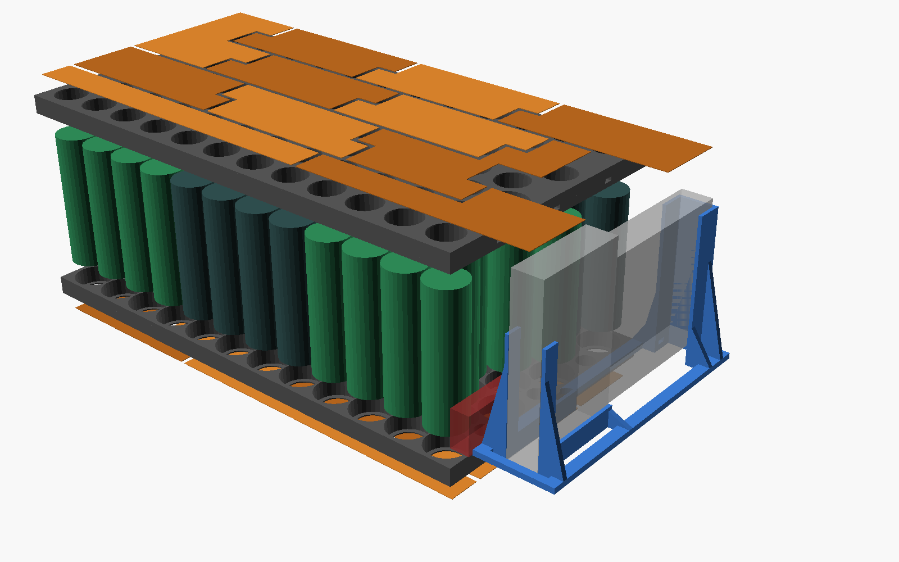
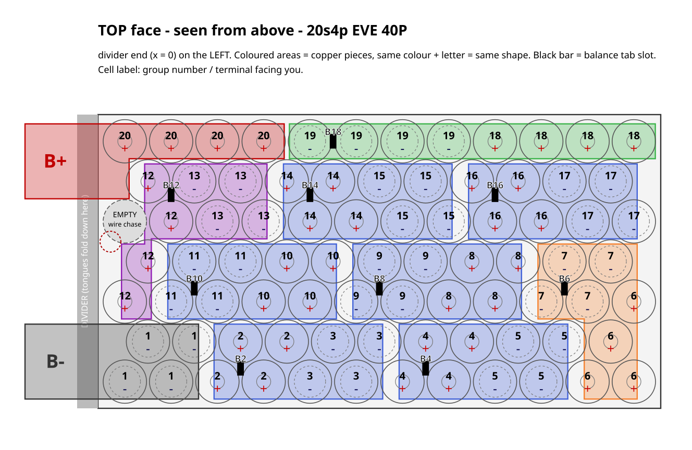
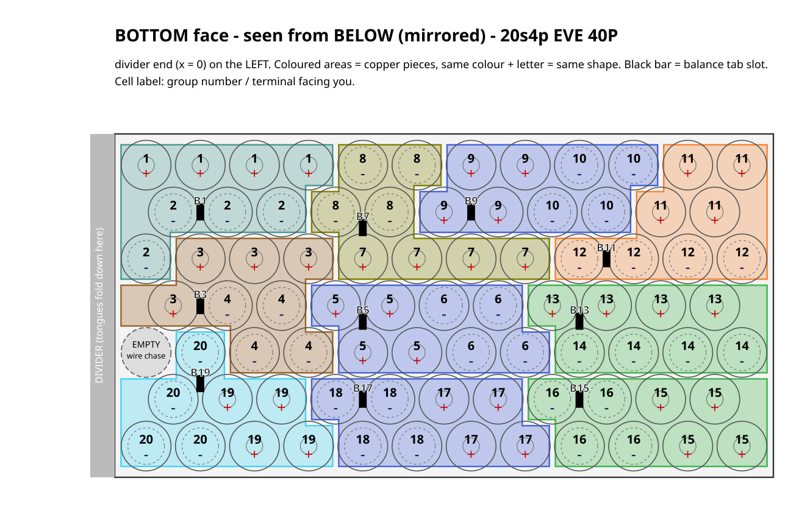
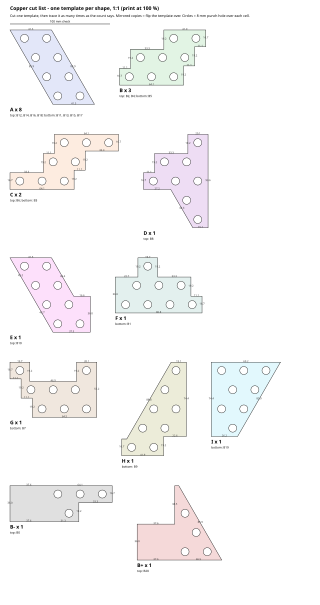
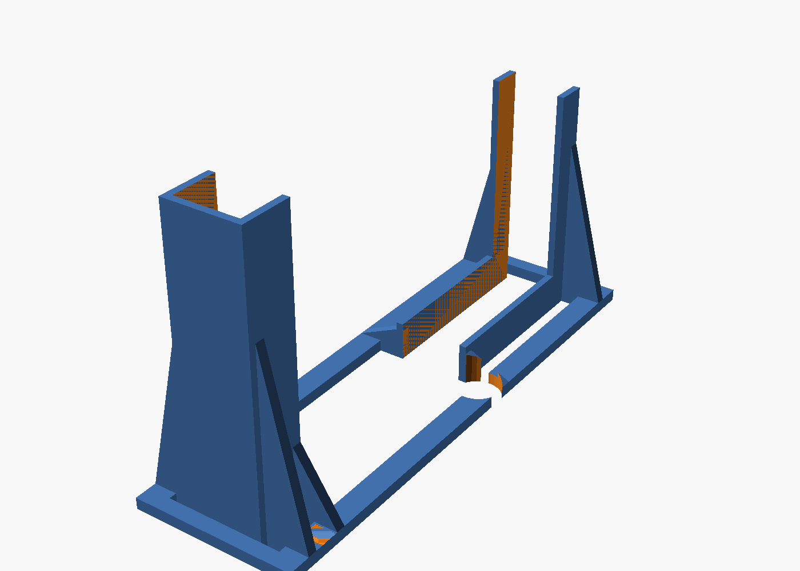

# MaxG3Cellholder

Cellholder for a custom 20s4p battery for the Segway Ninebot Max G3 without cutting the divider in the deck compartment.

* **Cells:** 80 × EVE INR21700-40P (Ø21.15 ±0.10 mm, 70.15 ±0.15 mm)
* **Configuration:** 20s4p, 72 V nominal / 84 V full
* **Envelope:** 141 × 270 mm footprint. Holder + cells are **71.8 mm** tall, which leaves ~9 mm of the 81 mm for copper, nickel, fish paper and heat shrink.
* **Placement:** the pack sits in front of the deck divider. The **BMS (ANT 24ZHE6-24S-220A) stands upright in a printed stand on the other side** of the divider. Every lead and balance wire leaves the pack at the divider end.
* **Printed parts:** only what's needed. Two holder halves (84 cm³ each) and the BMS stand (18 cm³). No cover plates.



---

## 1. What's in the repo

| Path | What it is |
|---|---|
| `stl/holder_bottom.stl`, `stl/holder_top.stl` | Cell holder halves, one piece each (needs a ≥ 270 mm bed) |
| `stl/holder_*_a.stl` / `_b.stl` | The same halves split in two for beds < 270 mm. The seam zig-zags between cells, so no cell sits on it. |
| `stl/bms_stand.stl` | Stand that holds the BMS upright behind the divider (§8) |
| `docs/copper_cutlist.svg` | **Copper cut list:** every distinct copper shape once, 1:1, with count, edge lengths and punch holes |
| `docs/copper_roll_plan.svg` | Every copper piece laid out on a **100 mm wide roll** |
| `docs/copper_top.svg`, `docs/copper_bottom.svg` | 1:1 position of every copper piece on each face, with punch holes, tab flaps and tongue fold lines |
| `docs/wiring_top.svg`, `docs/wiring_bottom.svg` | Wiring diagrams: group numbers, cell polarity, copper pieces and balance taps |
| `docs/layout.md` | Cut list table, plus every group, cell and copper piece |
| `scad/cellholder.scad` | Parametric OpenSCAD model: holder, BMS stand, tolerances, BMS size |
| `scad/layout_data.scad` | Generated layout data (do not edit by hand) |
| `generator/layout.py` | Generates the layout, copper pieces, diagrams and templates |

Coordinates used everywhere:

* **x** runs along the 270 mm length. **x = 0 is the divider end of the pack.**
* **y** runs across the 141 mm width. **y = 0 is the side wall the screw post's 80 mm is measured from.**
* **z** is up from the deck floor.

---

## 2. Layout and copper




The footprint fits a staggered grid of 7 rows (12/11/12/11/12/11/12) at 22.2 mm pitch. That makes **81 slots for 80 cells**. The spare slot is left empty at the divider end and doubles as a wire chase (§4).

Almost every 4p group is a compact **2 × 2 diamond**: 2 cells in one row and 2 in the next. The pack is built from bands of them:

| Rows (from the y = 0 side) | Groups | Direction |
|---|---|---|
| Rows 1–2 | **G1 → G5** (G1 = **B−**) | away from the divider |
| Far end | G6 | turn |
| Rows 3–4 | **G7 → G11** | back to the divider |
| Divider end | G12 | turn |
| Rows 5–6 | **G13 → G17** | away from the divider |
| Row 7 | **G18 → G20**, 4 cells in a line (G20 = **B+**) | back to the divider |

### Copper pieces: one straight bar per row



**Each copper piece is a straight bar along each row of cells it covers.**

* Where a piece covers two rows, the two bars are offset by half a cell (that's how the cells are staggered), giving a simple **step shape**.
* Every edge is a straight, square cut.
* **Every cell is fully covered.** Each piece only covers the cells of its own groups, so it is easy to see where it goes.

| Shape | Count | Size | What it is |
|---|---|---|---|
| **A** | **9** | 97.4 × 36 mm step: two 86.3 mm bars, offset 11.1 mm | Standard piece: two diamonds, 8 cells |
| **B** | 2 | same as A with one end squared off at the pack wall | |
| **C** | 2 | 175.5 × 16.7 mm strip | Row 7: 8 cells in a line |
| D–I | 1 each | step shapes | Turn pieces at the two ends of the pack |
| **B−**, **B+** | 1 each | with a **36 × 35 mm lead tongue** | Main leads (§5) |

**How to prepare the copper:**

* **Punch holes:** there's one 8 mm circle over every cell. Punch a hole there, lay the nickel strip over the copper, and weld the nickel to the cell through the hole and to the copper around it. Change `PUNCH_D` in `generator/layout.py` if your punch is a different size. The hole must be smaller than the cell's positive cap.
* **Cells are recessed 0.6 mm:** each cell stops against a thin lip 0.6 mm below the holder face. The copper lies flat on the holder, and the nickel only has to dip about 0.8 mm (lip + copper) through the hole to reach the cell.
* **Roll plan:** `docs/copper_roll_plan.svg` lays out every piece of both faces on a **100 mm wide roll**. One pack uses about **1.1 m of roll** per copper layer.
* **Gaps:** neighbouring pieces have a 2.5 mm gap. The generator checks that no copper ever comes within 10 mm of another group's cell centre.

**Other things to know about the layout:**

* **B− (G1)** and **B+ (G20)** both end at the divider end, on the **top** face.
* Copper pieces:
  * **Top face:** B0 (G1, main −), then B2, B4 … B18, then B20 (G20, main +). That's 11 pieces.
  * **Bottom face:** B1, B3 … B19. That's 10 pieces.
* The balance tap number equals the copper piece number. Taps B0–B20 go to BMS balance pins 0–20 (B0 = B−, B20 = B+).
* **Bands keep voltages low.** Neighbouring copper pieces are at most 12 groups apart (~50 V). Still lay fish paper over each face before wrapping.
* **The last row is the one compromise.** Seven rows can't be split into 2-row bands only. In row 7 the groups G18 → G19 → G20 sit end to end, so current flows lengthwise along the two C strips. **Use double-thickness copper (two layers) for the two C strips.**

To change the layout, edit `GROUP_PATTERN` in `generator/layout.py` and run it again (§10).

---

## 3. Stack-up (height budget 81 mm)

| Layer | mm |
|---|---|
| Fish paper / foam under the pack | your choice |
| Copper + nickel, bottom | ~0.4 |
| Cell recess (thin end-stop lip) | 0.6 |
| Cell (70.15 + 0.15 tolerance + fish-paper ring) | 70.6 |
| Cell recess, top | 0.6 |
| Copper + nickel, top | ~0.4 |
| **Total without wrap** | **~72.6** |

* **Holder halves:** each is 9.6 mm tall, with 9 mm deep sockets. Between the halves the cells are bare, over a 52.6 mm gap.
* **Bore:** Ø21.6 mm, for a snug FDM fit. If your printer prints holes small or large, change `cell_bore`, which is set in **both** `scad/cellholder.scad` and `generator/layout.py`.
* **Welding window:** Ø17 mm, the opening in the end stop over every cell.

---

## 4. Deck features

### Divider (20 mm tall, 10 mm wide, full width)

The pack's x = 0 face sits against the divider. Nothing passes under or through the divider, so the 0.5 mm indent under it doesn't matter. Everything that goes to the BMS leaves the pack **above z = 20 mm** at the divider end and goes over the divider:

* **Top balance wires** run over the top face, under the fish paper, to the divider end.
* **Bottom balance wires** run under the bottom face to the **wire chase**: the empty cell slot at the divider end, open top to bottom. The wires rise inside it and leave sideways through the open gap between the holder halves, above the divider.
* **Main leads:** see §5.

### Screw post (80 mm from the side wall, 10 mm tall, just in front of the divider)

The post is on the **BMS side** of the divider (`post_side = "bms"`), so the **BMS stand** has a notch for it and stands just behind it (§8).

* If it turns out to be on the **pack side**, set `post_side = "pack"`. The bottom holder half then gets a Ø12 × 11 mm pocket, and the empty cell slot is placed right over the post.
* If the 80 mm is measured from the **other** side wall, set `POST_FROM_SIDE = 141 - 80` (= 61) in `generator/layout.py`. The whole pattern mirrors automatically.

**Measure before you print:**

* post diameter (assumed Ø10)
* distance from the divider (assumed centre 6 mm)
* which side wall the 80 mm is measured from

---

## 5. Main leads (B−, B+): solder first, then weld

You can't solder to the copper once it's welded: the copper soaks up the heat and cooks the cells. So the leads go onto **tongues that stick out past the end of the pack**, and you solder them on the bench before any cell is touched.

1. Cut the **B−** and **B+** pieces from the cut list **with the tongue**. Each tongue is 36 mm wide and runs **35 mm** past the x = 0 edge (dashed fold line on the template). A doubled tongue (two layers of copper) makes the joint even stronger.
2. **On the bench, with no cells near it:** tin the tongue and solder the lead (10 or 12 AWG silicone) along the outer ~20 mm. A 100 W+ iron or a small torch makes copper easy. Let it cool and slide heat shrink over the joint.
3. Pre-bend the tongue 90° **downwards** at the x = 0 edge.
4. Lay the piece on its cells, add the nickel and weld. The joint hangs down the divider-end face of the top holder half, **above the divider**.
5. **Strain relief:** put a zip tie through a **tie slot** in the end wall of the top holder half (at y = 32, 70.5 and 109). The slot at y = 32 sits under the B− tongue and the slot at y = 109 under the B+ tongue. The tie wraps the end wall, so the lead's weight pulls on the plastic, not on the welds.

**No-solder alternative:** crimp a ring lug on the lead and bolt it to the tongue with M5 or M6 (spring washer + nyloc), outside the pack.

## 6. Balance tabs

There is one tab per copper piece, at the small rectangle on the templates. It sits over plastic between the cells, never over a cell terminal.

1. On each copper piece, cut a **5 × 7 mm U-flap** at the marked spot.
2. **Solder the balance wire (22–24 AWG silicone) to the flap on the bench**, before welding. Then weld the piece. Solder the B0 and B20 balance wires to the main-lead tongues in the same bench step.
3. Run the wires to the divider end:
   * **Top face:** lay the wires flat on the top face.
   * **Bottom face:** lay them flat on the bottom face and route them up through the wire chase.
4. Fix them with kapton tape, then cover each face with fish paper.
5. Put a fuse or PTC on each balance lead at the connector end if your BMS harness doesn't already have them.

---

## 7. Printing

* **Material: PETG, ASA or ABS. Not PLA** (it creeps and softens in a hot deck).
* 0.2 mm layers (the 0.6 mm lip is 3 layers), 3 walls, 15–25 % infill.
* **Holder halves:** print the face with the cell lips **down** (as exported). No supports.
* **BMS stand:** print as exported (fins straight up). No supports.
* **Split parts** (`_a`/`_b`): glue the two parts of each half at the zig-zag seam (CA or plastic weld). The welded copper also ties them together.
* Print one test strip first and check the cell fit. Cells should push in firmly by hand.

## 8. BMS stand



The ANT BMS (125 × 90 × 16 mm) **stands upright on its long edge**, parallel to the divider, right behind the screw post. It only takes about **45 mm of deck length** past the divider.

* **Height:** the BMS is 90 mm tall standing, so make sure the space past the divider has at least ~91 mm.
* **Connector end** (the wide 90 mm head with the balance connectors): a low channel holds the bottom edge, and two side fins grip the faces only. The connectors stay free to plug in.
* **Narrow end** (70 mm section where the power leads come out): a U-clamp holds the end edge. The narrow section sits 10 mm off the floor, so the lower leads have room to bend outwards.
* **Hold-down:** one zip tie through the holes in the U-clamp fins, looped **under** the narrow section and over its top edge.
* **Base:** an open frame with braces, so it can't tip over. It has a notch where it passes the 10 mm screw post.

Settings in `scad/cellholder.scad`:

* `bms_head_at`: which side of the deck the connector end faces (`"y0"` or `"y1"`)
* `bms_y`: where the BMS sits across the deck
* `bms_*` sizes, if you change BMS

Then run `sh scad/export.sh`.

## 9. Assembly order

1. Insert the cells into the **bottom** half, following `docs/wiring_bottom.svg`. Then fit the **top** half.
   * **Top** terminals: G1 is **−** up, G2 is **+** up, and so on, alternating.
   * Before you weld anything, check every cell's polarity against the diagrams with a meter.
2. Fit fish-paper rings on the positive ends.
3. **Bottom face:**
   * Pre-solder the balance wires to the flaps of B1 … B19.
   * Lay the punched copper pieces (see `docs/copper_bottom.svg`; it's drawn as seen from below).
   * Weld the nickel through the holes.
   * Tape the wires and route them into the chase.
4. **Top face:**
   * Pre-solder the B− and B+ leads and the B2 … B18 balance wires.
   * Lay the copper, weld the nickel, fold the tongues down and zip-tie the leads.
5. Measure each tap against B0 before plugging into the BMS. Each step should be ~3.6–4.2 V.
6. Fish paper over both faces, then wrap the pack (foam + heat shrink). Make sure the controller is rated for **84 V** before connecting.

---

## 10. Regenerating / customising

```sh
pip install shapely                 # one time
python3 generator/layout.py         # layout -> scad/layout_data.scad + docs/*.svg + docs/layout.md
sh scad/export.sh                   # all STLs into stl/ (OpenSCAD 2021.01+)
openscad scad/cellholder.scad       # preview, set part = "assembly" / "exploded"
```

Parameters live in two places:

* **`generator/layout.py`:**
  * envelope (`PACK_L`, `PACK_W`) and `PITCH`
  * the screw post (`POST_FROM_SIDE`, `POST_FROM_DIVIDER`, `POST_D`, `POST_H`)
  * copper gap, punch hole size (`PUNCH_D`), lead tongue size (`LEAD_W`, `LEAD_LEN`) and roll width (`ROLL_W`)
  * the group pattern (`GROUP_PATTERN`)
* **`scad/cellholder.scad`:**
  * cell size and bore, welding window, cell recess, socket depth, tie slots
  * screw post side (`post_side`)
  * BMS size and stand settings
