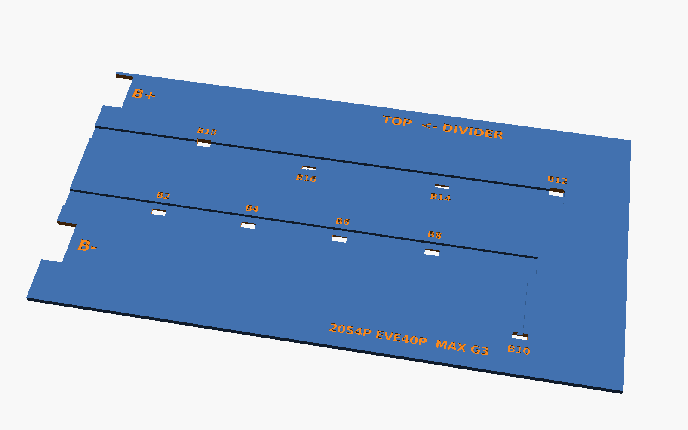
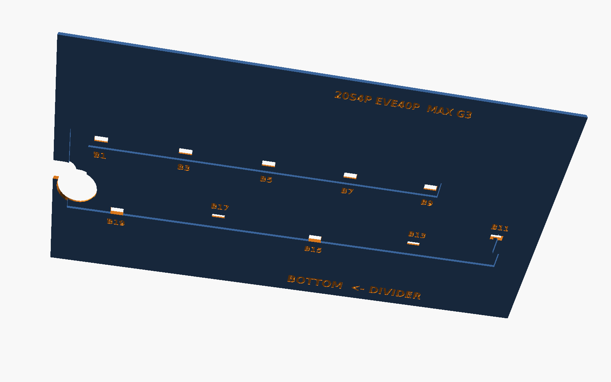
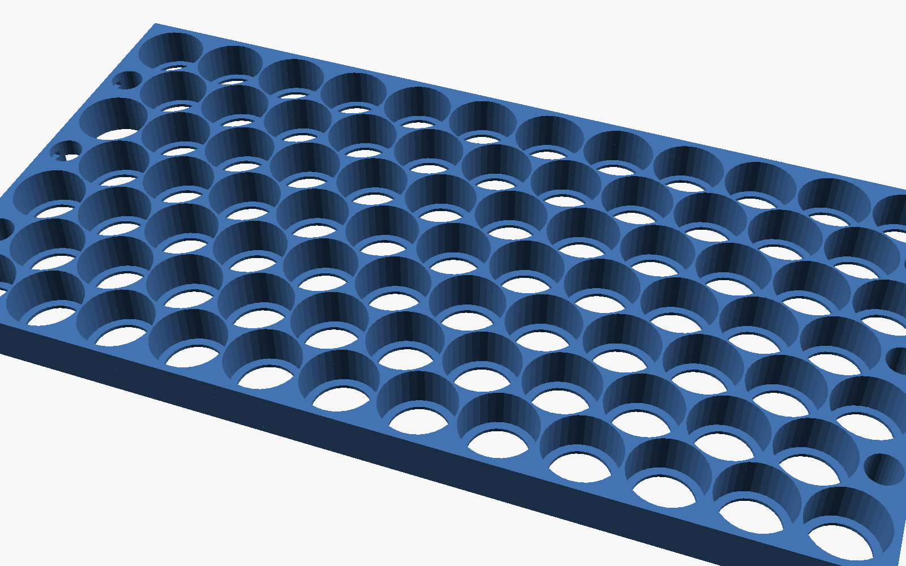

# MaxG3Cellholder

Cellholder for a custom 20s4p battery for the Segway Ninebot Max G3 without cutting the divider in the deck compartment.

* **Cells:** 80 × EVE INR21700-40P (Ø21.15 ±0.10 mm, 70.15 ±0.15 mm)
* **Configuration:** 20s4p, 72 V nominal / 84 V full
* **Envelope:** 141 × 270 mm footprint. Assembled height is **79.8 mm**, which leaves 1.2 mm of the 81 mm for kapton or heat shrink.
* **Placement:** the pack sits in front of the deck divider and the BMS sits on the other side of the divider. Every lead and balance wire leaves the pack at the **divider end**.


---

## 1. What's in the repo

| Path | What it is |
|---|---|
| `stl/holder_bottom.stl`, `stl/holder_top.stl` | Cell holder halves, one piece each (needs a ≥ 270 mm bed) |
| `stl/holder_*_a.stl` / `_b.stl` | The same halves split in two for beds < 270 mm. The seam zig-zags between cells, so no cell sits on it. |
| `stl/lid_bottom.stl`, `stl/lid_top.stl` | Insulating cover plates with balance-tab slots, wire grooves, B−/B+ notches and labels |
| `stl/lid_*_a.stl` / `_b.stl` | The same plates split. The lid seam is ~33 mm away from the holder seam, so the lids bridge it. |
| `docs/wiring_top.svg`, `docs/wiring_bottom.svg` | Wiring diagrams: group numbers, cell polarity, copper pieces and balance taps |
| `docs/copper_top.svg`, `docs/copper_bottom.svg` | **1:1 copper cutting templates.** Print at 100 % and check the 100 mm bar. |
| `docs/layout.md` | Table of every group, cell and copper piece, with tab positions |
| `scad/cellholder.scad` | Parametric OpenSCAD model (tolerances, lip, rim, lid thickness, …) |
| `scad/layout_data.scad` | Generated layout data (do not edit by hand) |
| `generator/layout.py` | Generates the layout, diagrams and templates from the envelope, pitch and screw-post position |

Coordinates used everywhere:

* **x** runs along the 270 mm length. **x = 0 is the divider end.**
* **y** runs across the 141 mm width. **y = 0 is the side wall the screw post's 80 mm is measured from.**
* **z** is up from the deck floor.

---

## 2. Layout: simple 20s4p groups


The footprint fits a staggered grid of 7 rows (12/11/12/11/12/11/12) at 22.2 mm pitch. That makes **81 slots for 80 cells**. The spare slot sits right where the screw post is, at the divider end (see §4).

The series string is a plain **U**:

| Part of the pack | Groups | Shape | Contacts to next group |
|---|---|---|---|
| Lane A, rows 1–4 (y = 0 side), heading away from the divider | **G1 → G10** | Identical 4-cell zig-zag columns, one cell per row. Every copper piece in this lane is the same 2 × 4 parallelogram. | **7** |
| Turn at the far end | G11, G12, G13 | Compact 4-cell groups | 3–4 |
| Lane B, rows 5–7, heading back to the divider | **G14 → G20** | One 3-group pattern repeated (two "Y" groups + one diamond) | **5** |

* **B− (G1)** and **B+ (G20)** both end at the divider end, on the **top** face, at opposite sides of the pack (y ≈ 32 mm and y ≈ 128 mm).
* Every series joint is short and wide, so the copper only carries current about one cell pitch.
* Copper pieces:
  * **Top face:** B0 (G1, main −), then B2, B4 … B18 (pairs), then B20 (G20, main +). That's 11 pieces.
  * **Bottom face:** B1, B3 … B19. That's 10 pieces.
* The balance tap number equals the copper piece number. Taps B0–B20 go to BMS balance pins 0–20 (B0 = B−, B20 = B+).

> ⚠️ **High-voltage seam.** In any U layout the two lanes sit side by side. Along the line between row 4 and row 5 (y ≈ 80 mm), copper pieces up to ~80 V apart are 2.5 mm from each other. The worst spot is B0 against B20 at the divider end. Lay a strip of kapton or fish paper over that seam on both faces before fitting the lids.

| Top cover (B−/B+ notches, slots, grooves to the divider edge) | Bottom cover, seen from below (grooves to the wire chase, post notch) |
|---|---|
|  |  |

| Bottom holder half | Divider end: lead notches, tie slots, chase |
|---|---|
|  |  |

To change the layout, edit `GROUP_PATTERN` in `generator/layout.py` and run it again (§9).

---

## 3. Stack-up (height budget 81 mm)

| Layer | mm | z top |
|---|---|---|
| Bottom cover plate (wire grooves face the floor) | 2.8 | 2.8 |
| Holder rim, which leaves room for copper + nickel | 0.8 | 3.6 |
| Holder lip (welding window Ø17) | 1.0 | 4.6 |
| Cell (70.15 + 0.15 tolerance + fish-paper ring) | 70.6 | 75.2 |
| Lip + rim + top cover plate | 4.6 | **79.8** |

Each holder half is 13.8 mm tall with 12 mm deep sockets. Between the halves the cells are bare, over a 46.6 mm gap. The bore is Ø21.6 mm, which leaves a 0.6 mm web between neighbouring cells at 22.2 mm pitch and gives a snug FDM fit. If your printer prints holes small or large, change `cell_bore`, which is set in **both** `scad/cellholder.scad` and `generator/layout.py`.

---

## 4. Deck features

### Divider (20 mm tall, 10 mm wide, full width)

The pack's x = 0 face sits against the divider. Nothing passes under or through the divider, so the 0.5 mm indent under it doesn't matter.

Everything that has to reach the BMS leaves the pack **above z = 20 mm** at the divider end and goes over the divider:

* **Top balance wires** run in the top cover grooves straight to the x = 0 edge.
* **Bottom balance wires** run in the bottom cover grooves to the **wire chase**. The chase is the empty cell slot at the divider end, open top to bottom. The wires rise inside it and leave sideways through the open gap between the holder halves, at z ≈ 25–60 mm, which is above the divider.
* **Main leads:** see §5.

### Screw post (80 mm from the side wall, 10 mm tall, just in front of the divider)

There are 81 slots and we only need 80 cells. The spare slot is placed exactly where the post lands, at (x 12.9, y 89.7). The bottom holder half and bottom cover also have a Ø12 × 11 mm clearance pocket at the post position (x 6, y 80), open towards the divider.

* If the post turns out to be on the **BMS side** of the divider, nothing is lost: the slot is still the wire chase.
* If the 80 mm is measured from the **other** side wall, set `POST_FROM_SIDE = 141 - 80` (= 61). The generator mirrors the whole pattern automatically.

**Measure before you print.** Post diameter (assumed Ø10), distance from the divider (assumed centre 6 mm), and which side wall the 80 mm is from. Change `POST_*` in `generator/layout.py` to match.

---

## 5. Main leads (B−, B+): solder first, then weld

You can't solder to the copper once it's welded: the copper soaks up the heat and cooks the cells. So the leads go onto **tongues that stick out past the end of the pack**, and you solder them on the bench before any cell is touched.

1. Cut the **B0** and **B20** top pieces from the template **with the tongue**. The tongue is 20 mm wide and runs 15 mm past the x = 0 edge.
2. **On the bench, with no cells near it:** tin the tongue tip and solder the lead (10 or 12 AWG silicone) to the last ~10 mm of the tongue. A 100 W+ iron or a small torch makes copper easy. Let it cool and slide heat shrink over the joint.
3. Pre-bend the tongue 90° **downwards** at the x = 0 edge.
4. Lay the piece on G1 or G20 and spot-weld. The joint now hangs down the divider-end face of the top holder half, **above the divider** (that space is free above z = 20).
5. Strain relief: put a zip tie through the **tie slot** in the end wall of the top holder half. There's one at y = 32, 70.5 and 109; the slot at y = 32 sits right under the B− tongue. Each slot opens into the hollow end pocket. The tie wraps the end wall, so the lead's weight pulls on the plastic, not the welds.
6. The rim of the top holder and the top cover are both notched (22 mm) where the tongues pass, so nothing pinches them.

**No-solder alternative:** crimp a ring lug on the lead and bolt it to the tongue with M5 or M6 (spring washer + nyloc), outside the pack. Use a doubled-over or 0.5 mm copper tongue for this.

## 6. Balance tabs

There is one tab per copper piece, at the black rectangle on the templates. Each tab sits over a plastic **web between three cells**, never over a cell terminal.

1. On each copper piece, cut a **5 × 7 mm U-flap** at the marked spot, before welding.
2. **Solder the balance wire (22–24 AWG silicone) to the flap on the bench**, the same as the main leads. Then weld the piece.
3. Fold the flap up. Wire and flap pass through the **7 × 3.2 mm slot** in the cover plate. The tap number is engraved next to the slot, mirrored on the bottom cover so it reads from below.
4. Press the wire into the groove. Branch grooves lead to wider collector channels:
   * Top cover: 2 channels running to the x = 0 edge.
   * Bottom cover: 2 channels plus a cross channel into the wire chase.
5. Tape over the grooves with kapton. Put a fuse or PTC on each balance lead at the connector end if your BMS harness doesn't already have them.

Wire counts: the top cover carries 9 wires (B2, B4 … B18) and the bottom cover 10 (B1, B3 … B19). Solder the B0 and B20 balance wires onto the main-lead tongues in the same bench step as the main leads.

---

## 7. Printing

* **Material: PETG, ASA or ABS. Not PLA** (it creeps and softens in a hot deck).
* 0.2 mm layers, 3–4 walls, 25–40 % infill.
* **Holder halves:** print rim/lip face **down** (as exported). No supports.
* **Cover plates:** print the **outer face down** (as exported), so the pegs point up. No supports. The grooves bridge 2–10 mm.
* **Split parts** (`_a`/`_b`): glue the holder halves at the zig-zag seam (CA or plastic weld). The cover plates are split at x = 168 mm, so they bridge the holder seam once fitted.
* Print one test strip first and check the cell fit. Cells should push in firmly by hand.

## 8. Assembly order

1. Insert the cells into the **bottom** half, following `docs/wiring_bottom.svg`. Then fit the **top** half.
   * **Top** terminals: G1 is **−** up, G2 is **+** up, and so on, alternating.
   * Before you weld anything, check every cell's polarity against the diagrams with a meter.
2. Fit fish-paper rings on the positive ends.
3. **Bottom face:**
   * Pre-solder the balance wires to the flaps of B1 … B19.
   * Weld the pieces (see `docs/copper_bottom.svg`; it's drawn as seen from below).
   * Kapton over the high-voltage seam.
   * Fit the bottom cover: the wires go through the slots and are routed into the chase.
4. **Top face:**
   * Pre-solder the B− and B+ leads and the B2 … B18 balance wires.
   * Weld, fold the tongues down, add the kapton seam strip, fit the top cover and zip-tie the leads.
5. Measure each tap against B0 before plugging into the BMS. Each step should be ~3.6–4.2 V.
6. Wrap the pack (fish paper / foam + heat shrink). Make sure the controller is rated for **84 V** before connecting.

---

## 9. Regenerating / customising

```sh
pip install shapely                 # one time
python3 generator/layout.py         # layout -> scad/layout_data.scad + docs/*.svg + docs/layout.md
sh scad/export.sh                   # all STLs into stl/ (OpenSCAD 2021.01+)
openscad scad/cellholder.scad       # preview, set part = "assembly" / "exploded"
```

Parameters live in two places:

* **`generator/layout.py`:** envelope (`PACK_L`, `PACK_W`), `PITCH`, the screw post (`POST_FROM_SIDE`, `POST_FROM_DIVIDER`, `POST_D`, `POST_H`), copper gap, and the group pattern.
* **`scad/cellholder.scad`:** cell size and bore, window, lip, socket depth, rim, cover thickness, grooves, tie slots, lead notch width.

The model `assert`s that the total height stays ≤ 81 mm.
